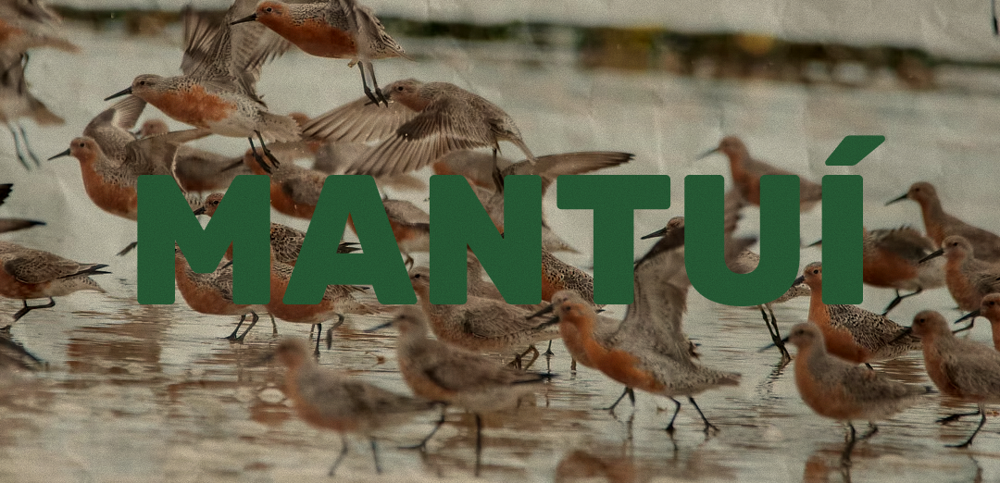

<p align="center">
  
</p>

<h1 align="center">🐦 Mantuí: Projeto Integrador</h1>

<p align="center">
  <em>O Mantuí é um projeto de pesquisa direcionado para o desenvolvimento de uma plataforma web offline-first, voltada à conservação de aves limícolas migratórias.</em>
</p>

<p align="center" >
  <a href="#-sobre-o-projeto">Sobre</a> •
  <a href="#-Autores">Autores</a> •
  <a href="#-funcionalidades">Funcionalidades</a> •
  <a href="#-tecnologias">Tecnologias</a> •
  <a href="#-estrutura-do-projeto">Estrutura</a> •
  <a href="#-como-executar-o-projeto">Execução</a> •
  <a href="#-rotas-ou-páginas">Rotas</a> •
  <a href="#-Contato">Contato</a>
</p>

---

## 📌 Sobre o projeto

O **Mantuí** é um sistema web **offline-first** criado para apoiar o monitoramento e a conservação de **aves limícolas migratórias** no litoral do Rio Grande do Norte. A plataforma permite registrar avistamentos com geolocalização, organizar dados de campo, gerar relatórios e auxiliar no gerenciamento de equipes, mesmo em áreas com acesso limitado ou inexistente à internet.

O projeto foi pensado para atender às necessidades de pesquisadores envolvidos em ações de conservação, especialmente diante dos desafios do monitoramento em regiões remotas e da importância ecológica dessas aves para a biodiversidade. Sua proposta está conectada ao contexto do **Flyways Brasil**, iniciativa da **SAVE Brasil** voltada à conservação de aves limícolas e seus habitats na Bacia Potiguar.

### 🎯 Objetivo

Desenvolver uma plataforma acessível, intuitiva e responsiva que otimize o monitoramento de aves limícolas migratórias, facilite o registro e a análise de dados coletados em campo e apoie a produção de evidências para conservação e formulação de políticas públicas.

### 👥 Público-alvo

Este sistema foi idealizado, inicialmente, para **Pesquisadores da Flyways Brasil**.

---

## 👨‍💻 Autores

| Nome | Função |
|------|-----------|
| Augusto Andrei de Melo Maux | Desenvolvedor Frontend e Backend |
| Eduardo Felipe Silva de Oliveira | Desenvolvedor Frontend e Designer |
| Pedro Vinícios Martins de Lima | Desenvolvedor Frontend e Designer |

---

## ✨ Funcionalidades

- Fazer cadastro diferenciando os tipos de usuário;
- Fazer login;
- Personalizar perfil de usuário;
- Registrar aves;
- Validar aves;
- Registrar observações de aves.
- Validar observações de aves;
- Registrar impactos ambientais;
- Validar impactos ambientais;
- Validar registro dos impactos ambientais;
- Exportar relatórios (de quê?) com gráficos;
- Disponibilizar dados para acesso público;
- Informar impactos da região observada no relatório;
- Dividir o mapa de observações de aves entre as regiões do RN;
- Criar questionário para pedir permissão para disponibilização dos dados pessoais;
- Adicionar áudio e foto das aves;
- Diferenciar fontes dos dados do sistema;
- Questionar o tempo de experiência do usuário ou se é ornitólogo;
- Apresentar panorama das unidades de observação de aves do RN;
- Enviar mensagens de validação dos moderadores aos usuários;
- Gerar infográfico com as aves e espécies mais registradas por região e período;
- Gerar infográfico dos moderadores que mais registraram aves e espécies;

---

## 🛠 Tecnologias

As principais tecnologias utilizadas no projeto foram:

- **Python**
- **Flask**
- **Flask-WTF**
- **HTML5**
- **Tailwind CSS**
- **JavaScript**
- **Node.js / npm**

---

## 📁 Estrutura do Projeto

O projeto Mantuí utiliza Flask como framework principal, Tailwind CSS para estilização e JavaScript para interatividade.

### Estrutura de Pastas

```bash
Mantui-Vetor-PI/
│
├── app/
│   ├── __init__.py          # Inicializa a aplicação Flask
│   ├── auth/                # Rotas e funcionalidades de autenticação
│   ├── forms/               # Formulários utilizando Flask-WTF
│   ├── models/              # Modelos do banco de dados
│   ├── routes/              # Rotas principais da aplicação
│   ├── static/
│   │   ├── css/
│   │   │   ├── input.css    # Arquivo de entrada do Tailwind
│   │   │   └── main.css     # CSS gerado automaticamente
│   │   ├── js/              # Scripts JavaScript
│   │   └── images/          # Imagens utilizadas no projeto
│   └── templates/
│       ├── partials/        # Componentes reutilizáveis (navbar, footer etc.)
│       ├── base.html        # Template base da aplicação
│       └── *.html           # Demais páginas
│
├── .venv/                   # Ambiente virtual Python (não versionado)
├── node_modules/            # Dependências do Node.js (não versionado)
├── requirements.txt         # Dependências Python
├── package.json             # Dependências e scripts do Tailwind
├── package-lock.json        # Controle de versões das dependências Node
├── tailwind.config.js       # Configuração do Tailwind
├── .gitignore               # Arquivos ignorados pelo Git
├── README.md                # Documentação do projeto
└── run.py                   # Arquivo responsável por iniciar a aplicação
```

---

## ▶️ Como executar o projeto

### 1. Clonar o repositório

```bash
git clone URL_DO_REPOSITORIO
cd Mantui-Vetor-PI
```

### 2. Criar e ativar o ambiente virtual

#### Git Bash

```bash
python -m venv .venv
source .venv/Scripts/activate
```

#### Windows PowerShell

```bash
python -m venv .venv
.venv\Scripts\Activate.ps1
```

### 3. Instalar as dependências Python

```bash
pip install -r requirements.txt
```

### 4. Instalar as dependências do Tailwind

```bash
npm install
npm install -D tailwindcss@3.4.19 postcss autoprefixer
```

### 5. Executar o projeto

#### Terminal 1

```bash
npm run tw:watch
```

#### Terminal 2

```bash
python run.py
```

### 6. Acessar a aplicação

Abra o navegador e acesse:

```bash
http://127.0.0.1:5000
```

---

## 🔀 Rotas ou páginas

| Rota | Descrição |
|------|-----------|
| `/` | [Página inicial - Landing] |
| `/login` | [Página de autenticação] |
| `/cadastro` | [Página de cadastro, se não existir login] |
| `/home` | [Área principal do sistema] |

---

## 📬 Contato

Se você tem dúvidas, sugestões ou quer entrar em contato, pode me encontrar por:

- **E-mail(s):** eduardo.felipe1@escolar.ifrn.edu.br | augusto.maux@escolar.ifrn.edu.br | p.vinicios@escolar.ifrn.edu.br
- **GitHub:** https://github.com/Eddur404 | https://github.com/Augusto-Maux | https://github.com/pedromartinssl
- **Local:** Natal, Rio Grande do Norte, Brasil
